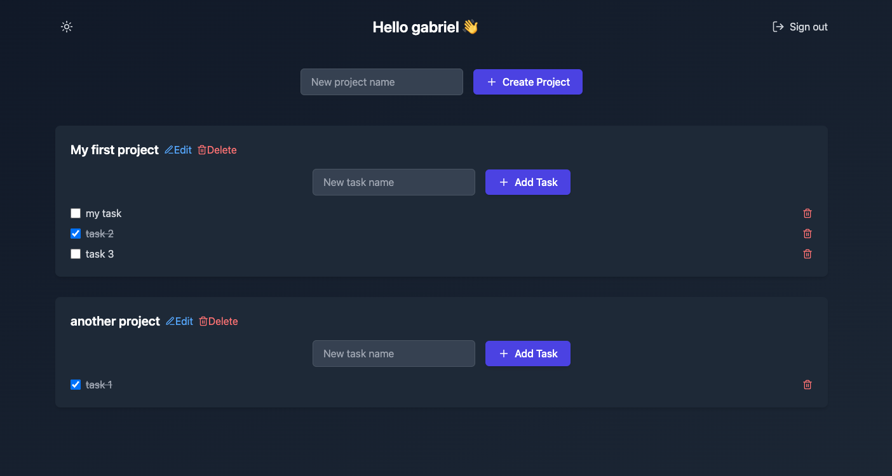

# Todo App

This is a simple task management application (Todo App), divided into a backend (NestJS) and a frontend (React with Vite). The backend uses DynamoDB as a database and can run locally with DynamoDB Local.



## Prerequisites

Make sure you have the following tools installed:

- **Node.js**: [https://nodejs.org/](https://nodejs.org/)
- **Docker**: [https://www.docker.com/](https://www.docker.com/) (to run DynamoDB Local)
- **AWS CLI**: [https://aws.amazon.com/cli/](https://aws.amazon.com/cli/)
- **Yarn** (optional): [https://yarnpkg.com/](https://yarnpkg.com/)


## Setting Up the Backend (Folder `server`)

### Step 1: Install Dependencies

Navigate to the backend folder:

```bash
cd server
```

Install the dependencies:

```bash 
yarn install
```

### Step 2: Start DynamoDB Local with Docker
Run a container with DynamoDB Local using Docker:

```bash
docker run -d -p 8000:8000 amazon/dynamodb-local
```

Verify that the container is running with the command:

```bash
docker ps
```

Create the DynamoDB Table with GSI
You need to create the required table with a Global Secondary Index (GSI) for querying by email. Use the following AWS CLI command:

```bash
aws dynamodb create-table \
    --table-name todo-app \
    --attribute-definitions \
        AttributeName=PK,AttributeType=S \
        AttributeName=SK,AttributeType=S \
        AttributeName=GSI1PK,AttributeType=S \
        AttributeName=GSI1SK,AttributeType=S \
    --key-schema \
        AttributeName=PK,KeyType=HASH \
        AttributeName=SK,KeyType=RANGE \
    --billing-mode PAY_PER_REQUEST \
    --global-secondary-indexes \
        "[{
            \"IndexName\": \"GSI1PK-index\",
            \"KeySchema\": [
                {\"AttributeName\": \"GSI1PK\", \"KeyType\": \"HASH\"},
                {\"AttributeName\": \"GSI1SK\", \"KeyType\": \"RANGE\"}
            ],
            \"Projection\": {\"ProjectionType\": \"ALL\"}
        }]" \
    --endpoint-url http://localhost:8000
```

Para ver os dados locais

```bash
aws dynamodb scan \
    --table-name todo-app \
    --endpoint-url http://localhost:8000
```


### Step 3: Start the Backend
Run the NestJS server:

```bash
ENVIRONMENT=local yarn start
``` 
The backend will be available at: http://localhost:5173/


## Setting Up the Frontend (Folder frontend)
### Step 1: Install Dependencies
Navigate to the frontend folder:

```bash
cd frontend
``` 
Install the dependencies:

```bash
yarn install
``` 
### Step 2: Configure the Backend URL
Create a .env file in the frontend folder with the following content:

```bash
VITE_API_URL=http://localhost:3000
``` 
### Step 3: Start the Frontend
Run the frontend:

```bash
yarn dev
``` 
The frontend will be available at: http://localhost:5173

## System pictures
